# Social Management Service Documentation

## Problem Statement

**SeekFit** aims to provide a seamless and efficient wardrobe management experience. A critical
component of this service is the **Social Management** feature, which allows users to connect with
friends, manage groups, and collaborate effectively within the application. Ensuring robust social
interactions is essential for enhancing user engagement and satisfaction. This documentation
outlines the design and implementation of the Social Management Service, leveraging Domain-Driven
Design (DDD), Command Query Responsibility Segregation (CQRS), and event sourcing principles to
create a scalable, maintainable, and efficient system.

## Event Sourcing and CQRS

**Event Sourcing** and **CQRS** are architectural patterns employed to enhance the scalability,
maintainability, and responsiveness of the Social Management Service.

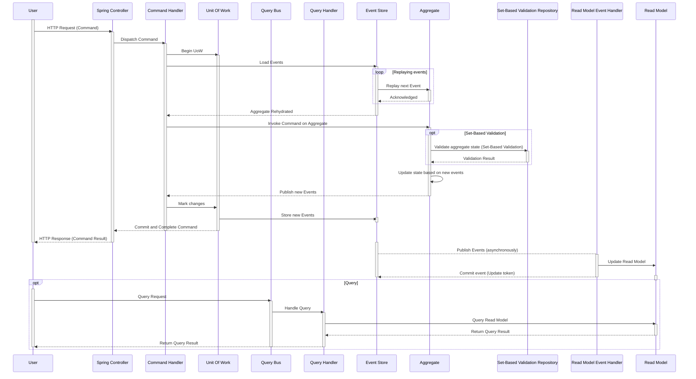

### Command Query Responsibility Segregation (CQRS)

CQRS separates the system's read and write operations, allowing them to scale independently and
simplifying the design by addressing each concern separately.

- **Commands**: Represent actions that modify the system's state. They are handled by the write
  model.
- **Queries**: Retrieve data without modifying the state. They are handled by the read model.

### Event Sourcing

Event Sourcing ensures that every change to the application state is captured as an event. These
events are immutable and stored sequentially, providing a complete history of all state changes.

- **Events**: Immutable records of actions that have occurred within the system.
- **Aggregates**: Consistent units of domain logic that handle commands and produce events.

By combining CQRS and Event Sourcing, the Social Management Service achieves a clear separation of
concerns, enhanced scalability, and an audit trail of all state changes.

## Entities

### User Aggregate

The **User** aggregate represents an individual user within the SeekFit application.

| **Attribute** | **Description**                |
|---------------|--------------------------------|
| `userId`      | Unique identifier for the user |
| `name`        | Name of the user               |

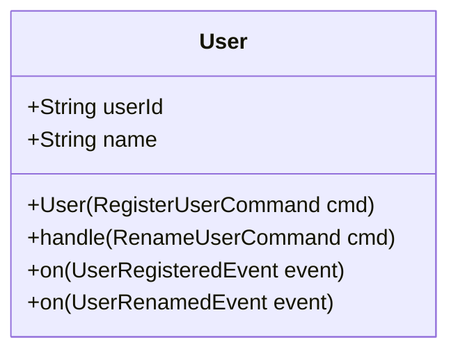

### UserFriendshipConnection Aggregate

The **UserFriendshipConnection** aggregate manages the friendship relationships between users.

| **Attribute**  | **Description**                                               |
|----------------|---------------------------------------------------------------|
| `friendshipId` | Unique identifier for the friendship connection               |
| `requesterId`  | User ID of the requester                                      |
| `recipientId`  | User ID of the recipient                                      |
| `status`       | Current status of the friendship (PENDING, ACCEPTED, IGNORED) |

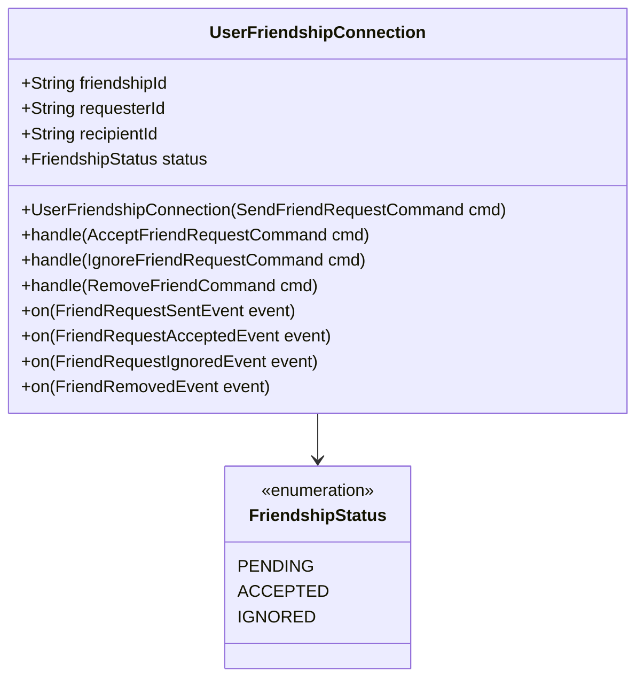

### Group Aggregate

The **Group** aggregate encapsulates the properties and behaviors of a user-managed group.

| **Attribute**     | **Description**                                    |
|-------------------|----------------------------------------------------|
| `groupId`         | Unique identifier for the group                    |
| `ownerId`         | User ID of the group owner                         |
| `name`            | Name of the group                                  |
| `description`     | Description of the group                           |
| `members`         | List of user IDs who are members of the group      |
| `invitationLinks` | List of invitation links associated with the group |

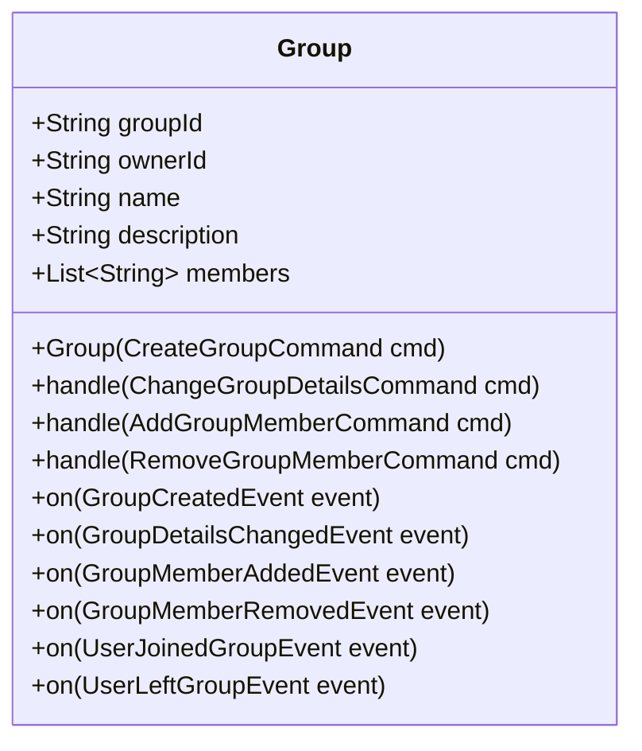

### Aggregate Associations within the Bounded Context

This section shows and describes the associations between the entities of the aggregates that model
the bounded context.

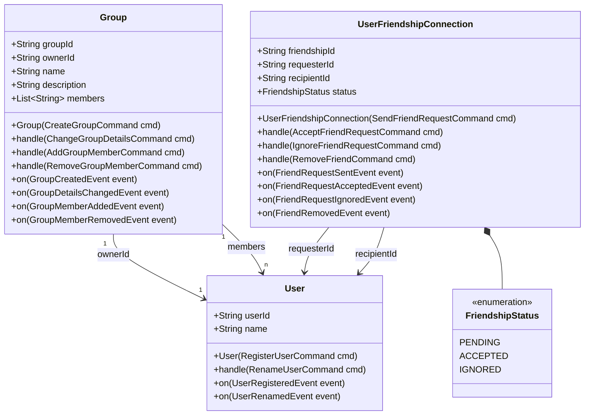

- A **User** can own multiple **Groups**.
- A **User** can have multiple **UserFriendshipConnections** with other users.
- A **Group** contains multiple **Users** as members.

## Commands and Events

### Commands

Commands represent actions that change the state of the system. Each command is handled by an
aggregate and may result in one or more events.

#### User Commands

| **Command**           | **Description**                       | **Invariants**                                                                                 |
|-----------------------|---------------------------------------|------------------------------------------------------------------------------------------------|
| `RegisterUserCommand` | Registers a new user in the system.   | `userId` must be unique.<br>`name` must be non-empty. <br>`name` must be unique across domain. |
| `RenameUserCommand`   | Changes the name of an existing user. | `userId` must exist.<br>`newName` must be non-empty.                                           |

##### RegisterUserCommand

| **Attribute** | **Description**                |
|---------------|--------------------------------|
| `userId`      | Unique identifier for the user |
| `name`        | Name of the new user           |

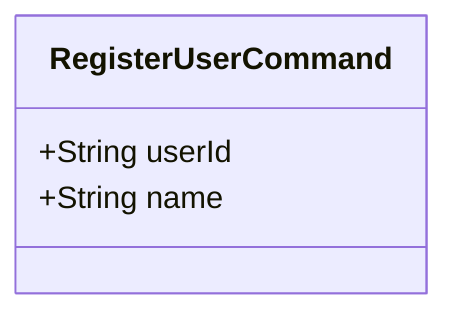

##### RenameUserCommand

| **Attribute** | **Description**                |
|---------------|--------------------------------|
| `userId`      | Unique identifier for the user |
| `newName`     | New name for the user          |

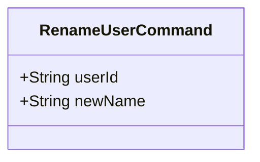

---

#### Friendship Commands

| **Command**                  | **Description**                                  | **Invariants**                                                                                                      |
|------------------------------|--------------------------------------------------|---------------------------------------------------------------------------------------------------------------------|
| `SendFriendRequestCommand`   | Sends a friend request from one user to another. | `friendshipId` must be unique.<br>`requesterId` and `recipientId` must be valid and distinct and user's must exist. |
| `AcceptFriendRequestCommand` | Accepts a pending friend request.                | `friendshipId` must exist and be in PENDING status.                                                                 |
| `IgnoreFriendRequestCommand` | Ignores a pending friend request.                | `friendshipId` must exist and be in PENDING status.                                                                 |
| `RemoveFriendCommand`        | Removes an existing friendship between users.    | `friendshipId` must exist and be in ACCEPTED status.                                                                |

##### SendFriendRequestCommand

| **Attribute**  | **Description**                              |
|----------------|----------------------------------------------|
| `friendshipId` | Unique identifier for the friendship request |
| `requesterId`  | User ID of the sender                        |
| `recipientId`  | User ID of the recipient                     |

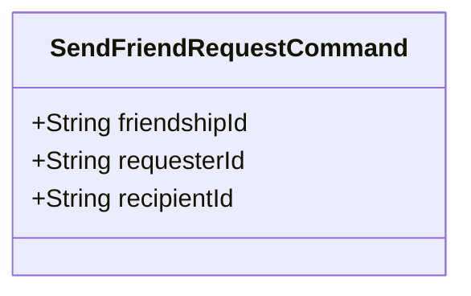

##### AcceptFriendRequestCommand

| **Attribute**  | **Description**                              |
|----------------|----------------------------------------------|
| `friendshipId` | Unique identifier for the friendship request |

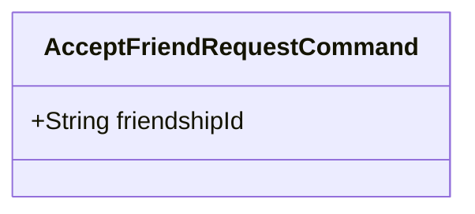

##### IgnoreFriendRequestCommand

| **Attribute**  | **Description**                              |
|----------------|----------------------------------------------|
| `friendshipId` | Unique identifier for the friendship request |

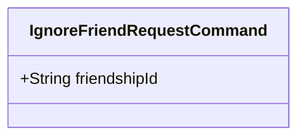

##### RemoveFriendCommand

| **Attribute**  | **Description**                      |
|----------------|--------------------------------------|
| `friendshipId` | Unique identifier for the friendship |

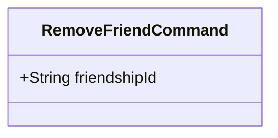

---

#### Group Commands

| **Command**                 | **Description**                                         | **Invariants**                                                                                                        |
|-----------------------------|---------------------------------------------------------|-----------------------------------------------------------------------------------------------------------------------|
| `CreateGroupCommand`        | Creates a new group.                                    | `groupId` must be unique.<br>`ownerId` must be a valid user.<br>`name` must be non-empty. <br>`name` must be unique.  |
| `ChangeGroupDetailsCommand` | Updates the name and/or description of a group.         | `groupId` must exist.<br>If provided, `name` must be non-empty.                                                       |
| `AddGroupMemberCommand`     | Adds a user to a group.                                 | `groupId` and `userId` must exist.<br>User must not already be a member.<br> User with provided `userId` must exist.  |
| `RemoveGroupMemberCommand`  | Removes a user from a group.                            | `groupId` and `userId` must exist.<br>User must be a member of the group.<br> User with provided `userId` must exist. |

##### CreateGroupCommand

| **Attribute** | **Description**                 |
|---------------|---------------------------------|
| `groupId`     | Unique identifier for the group |
| `ownerId`     | User ID of the group owner      |
| `name`        | Name of the group               |
| `description` | Description of the group        |

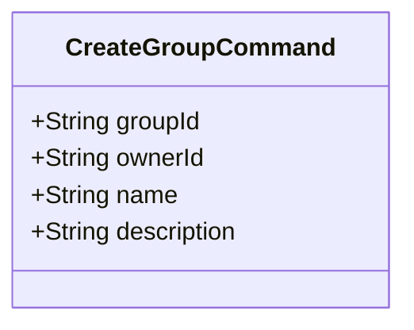

##### ChangeGroupDetailsCommand

| **Attribute** | **Description**                 |
|---------------|---------------------------------|
| `groupId`     | Unique identifier for the group |
| `name`        | New name for the group          |
| `description` | New description for the group   |

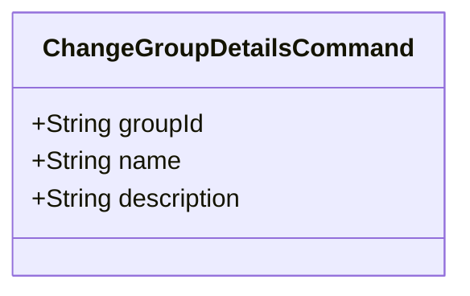

##### AddGroupMemberCommand

| **Attribute** | **Description**                 |
|---------------|---------------------------------|
| `groupId`     | Unique identifier for the group |
| `userId`      | User ID of the member to add    |

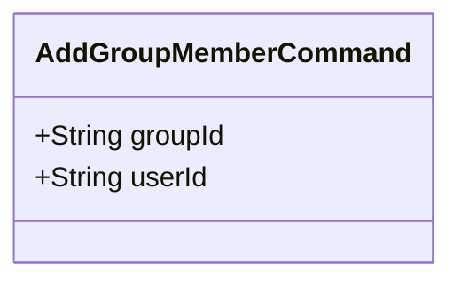

##### RemoveGroupMemberCommand

| **Attribute** | **Description**                 |
|---------------|---------------------------------|
| `groupId`     | Unique identifier for the group |
| `userId`      | User ID of the member to remove |

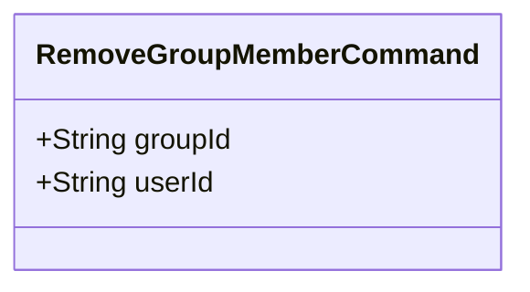

---

### Events

Events represent immutable records of actions that have occurred within the system. Each event
corresponds to a state change in an aggregate.

#### User Events

| **Event**             | **Description**                                |
|-----------------------|------------------------------------------------|
| `UserRegisteredEvent` | Indicates that a new user has been registered. |
| `UserRenamedEvent`    | Indicates that a user's name has been changed. |

##### UserRegisteredEvent

| **Attribute** | **Description**                |
|---------------|--------------------------------|
| `userId`      | Unique identifier for the user |
| `name`        | Name of the user               |

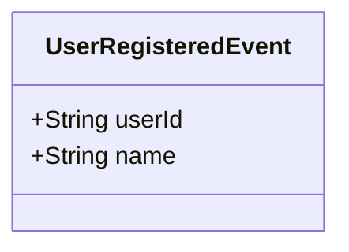

##### UserRenamedEvent

| **Attribute** | **Description**                |
|---------------|--------------------------------|
| `userId`      | Unique identifier for the user |
| `newName`     | New name of the user           |

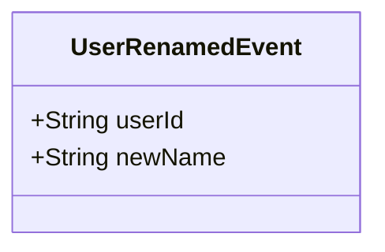

---

#### Friendship Events

| **Event**                    | **Description**                                    |
|------------------------------|----------------------------------------------------|
| `FriendRequestSentEvent`     | Indicates that a friend request has been sent.     |
| `FriendRequestAcceptedEvent` | Indicates that a friend request has been accepted. |
| `FriendRequestIgnoredEvent`  | Indicates that a friend request has been ignored.  |
| `FriendRemovedEvent`         | Indicates that a friendship has been removed.      |

##### FriendRequestSentEvent

| **Attribute**  | **Description**                              |
|----------------|----------------------------------------------|
| `friendshipId` | Unique identifier for the friendship request |
| `requesterId`  | User ID of the sender                        |
| `recipientId`  | User ID of the recipient                     |

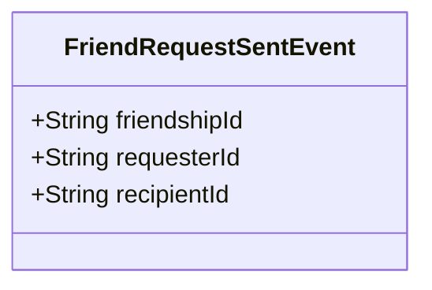

##### FriendRequestAcceptedEvent

| **Attribute**  | **Description**                              |
|----------------|----------------------------------------------|
| `friendshipId` | Unique identifier for the friendship request |

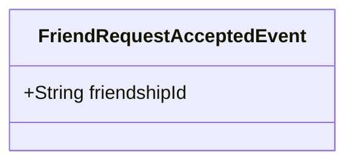

##### FriendRequestIgnoredEvent

| **Attribute**  | **Description**                              |
|----------------|----------------------------------------------|
| `friendshipId` | Unique identifier for the friendship request |

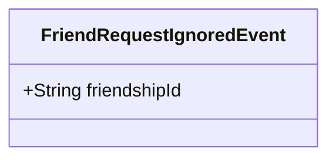

##### FriendRemovedEvent

| **Attribute**  | **Description**                      |
|----------------|--------------------------------------|
| `friendshipId` | Unique identifier for the friendship |

```mermaid
classDiagram
    class FriendRemovedEvent {
        +String friendshipId
    }
```

---

#### Group Events

| **Event**                  | **Description**                                                  |
|----------------------------|------------------------------------------------------------------|
| `GroupCreatedEvent`        | Indicates that a new group has been created.                     |
| `GroupDetailsChangedEvent` | Indicates that a group's details have been updated.              |
| `GroupMemberAddedEvent`    | Indicates that a member has been added to a group.               |
| `GroupMemberRemovedEvent`  | Indicates that a member has been removed from a group.           |
| `UserJoinedGroupEvent`     | Indicates that a user has joined a group via an invitation link. |
| `UserLeftGroupEvent`       | Indicates that a user has left a group.                          |

##### GroupCreatedEvent

| **Attribute** | **Description**                 |
|---------------|---------------------------------|
| `groupId`     | Unique identifier for the group |
| `ownerId`     | User ID of the group owner      |
| `name`        | Name of the group               |
| `description` | Description of the group        |

```mermaid
classDiagram
    class GroupCreatedEvent {
        +String groupId
        +String ownerId
        +String name
        +String description
    }
```

##### GroupDetailsChangedEvent

| **Attribute** | **Description**                 |
|---------------|---------------------------------|
| `groupId`     | Unique identifier for the group |
| `name`        | New name for the group          |
| `description` | New description for the group   |

```mermaid
classDiagram
    class GroupDetailsChangedEvent {
        +String groupId
        +String name
        +String description
    }
```

##### GroupMemberAddedEvent

| **Attribute** | **Description**                 |
|---------------|---------------------------------|
| `groupId`     | Unique identifier for the group |
| `userId`      | User ID of the added member     |

```mermaid
classDiagram
    class GroupMemberAddedEvent {
        +String groupId
        +String userId
    }
```

##### GroupMemberRemovedEvent

| **Attribute** | **Description**                 |
|---------------|---------------------------------|
| `groupId`     | Unique identifier for the group |
| `userId`      | User ID of the removed member   |

```mermaid
classDiagram
    class GroupMemberRemovedEvent {
        +String groupId
        +String userId
    }
```

##### UserJoinedGroupEvent

| **Attribute** | **Description**                         |
|---------------|-----------------------------------------|
| `groupId`     | Unique identifier for the group         |
| `userId`      | User ID of the member joining the group |

```mermaid
classDiagram
    class UserJoinedGroupEvent {
        +String groupId
        +String userId
    }
```

##### UserLeftGroupEvent

| **Attribute** | **Description**                         |
|---------------|-----------------------------------------|
| `groupId`     | Unique identifier for the group         |
| `userId`      | User ID of the member leaving the group |

```mermaid
classDiagram
    class UserLeftGroupEvent {
        +String groupId
        +String userId
    }
```

## Projections

The read model of the **Social Management Service** is implemented using a relational database, with
separate read models for each aggregate. Each read model is optimized for querying and maintains its
own set of tables without foreign key dependencies to other aggregates. This structured approach to
projections ensures that each view is tailored to its specific querying needs, adhering to the
principles of **Domain-Driven Design (DDD)**, **Command Query Responsibility Segregation (CQRS)**,
and **event sourcing**. By isolating read models per aggregate and avoiding cross-aggregate foreign
key dependencies, the system remains scalable, maintainable, and efficient.

---

### User View

**Description:**  
The **User View** provides a read-optimized representation of user data, containing essential
information required for profile management and user interactions within the application. This view
supports functionalities such as fetching user profiles and displaying friend lists.

```mermaid
erDiagram
    USER {
        string userId PK
        string name
    }
```

**Tables:**

- **USER**
    - **Purpose:** Stores minimal information about users for querying purposes.
    - **Columns:**
        - `userId` (Primary Key): Unique identifier for the user.
        - `name`: Name of the user.

---

### Group View

**Description:**  
The **Group View** consolidates all information related to user-managed groups, including group
details, members, and invitation links. This view facilitates efficient querying of group-related
data, membership lists, and active invitation links, enabling seamless group management and
collaboration within the application.

```mermaid
erDiagram
    GROUP {
        string groupId PK
        string ownerId
        string name
        string description
    }

    GROUP_MEMBER {
        string groupId
        string userId
        DateTime addedAt
    }

    GROUP_INVITATION_LINK {
        string linkId PK
        string groupId
        DateTime expirationTime
    }

    GROUP ||--o{ GROUP_MEMBER: contains
    GROUP ||--o{ GROUP_INVITATION_LINK: includes
```

**Tables:**

- **GROUP**
    - **Purpose:** Stores details of user-managed groups.
    - **Columns:**
        - `groupId` (Primary Key): Unique identifier for the group.
        - `ownerId`: ID of the user who owns the group.
        - `name`: Name of the group.
        - `description`: Description of the group.

- **GROUP_MEMBER**
    - **Purpose:** Tracks the members of each group.
    - **Columns:**
        - `groupId`: ID of the group the user belongs to.
        - `userId`: ID of the user who is a member of the group.
        - `addedAt`: Timestamp when the user joined the group.

- **GROUP_INVITATION_LINK**
    - **Purpose:** Stores invitation links for groups.
    - **Columns:**
        - `groupId`: ID of the group the link is associated with.
        - `expirationTime`: Expiry timestamp for the link.

**Associations:**

- **GROUP** has many **GROUP_MEMBER** entries.
- **GROUP** includes many **GROUP_INVITATION_LINK** entries.

---

### FriendshipConnection View

**Description:**  
The **FriendshipConnection View** manages all data regarding friendship relationships between users,
including friend requests and established friendships. This view enables efficient retrieval of a
user's friends and pending friend requests, supporting functionalities such as listing friends,
sending requests, and managing existing connections.

```mermaid
erDiagram
    USER_FRIENDSHIP_CONNECTION {
        string friendshipId PK
        string requesterId
        string recipientId
        string status
    }
```

**Tables:**

- **USER_FRIENDSHIP_CONNECTION**
    - **Purpose:** Maintains records of friendship connections between users.
    - **Columns:**
        - `friendshipId` (Primary Key): Unique identifier for the friendship.
        - `requesterId`: ID of the user who sent the friend request.
        - `recipientId`: ID of the user who received the friend request.
        - `status`: Current status of the friendship (`PENDING`, `ACCEPTED`, `IGNORED`).

**Notes:**

- The `requesterId` and `recipientId` are simple string fields representing user IDs. While they
  reference users, there are no foreign key constraints linking to the **USER** table in the **User
  View**, maintaining aggregate isolation.

---

```mermaid
erDiagram
    USER {
        string userId PK
        string name
    }

    GROUP {
        string groupId PK
        string ownerId
        string name
        string description
    }

    GROUP_MEMBER {
        string groupId
        string userId
        DateTime addedAt
    }

    GROUP_INVITATION_LINK {
        string linkId PK
        string groupId
        DateTime expirationTime
    }

%% Logical Connections
    USER ||--o{ GROUP: owns
    GROUP ||--o{ GROUP_MEMBER: contains
    GROUP ||--o{ GROUP_INVITATION_LINK: includes
    USER ||--o{ USER_FRIENDSHIP_CONNECTION: sendsRequests
    USER_FRIENDSHIP_CONNECTION ||--o| USER: requestsTo

```
